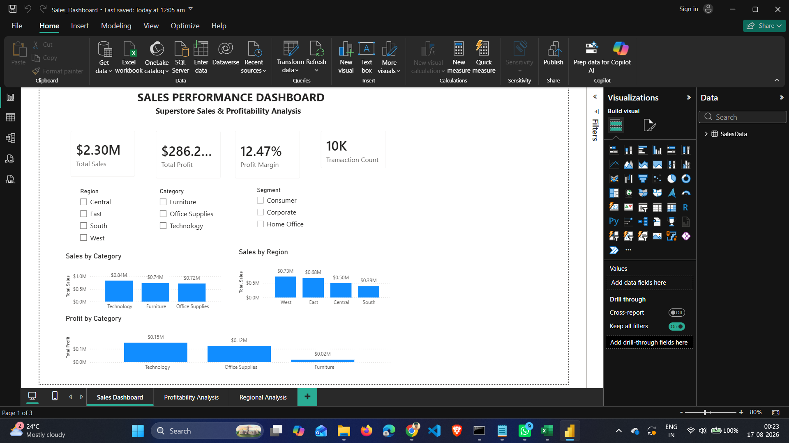
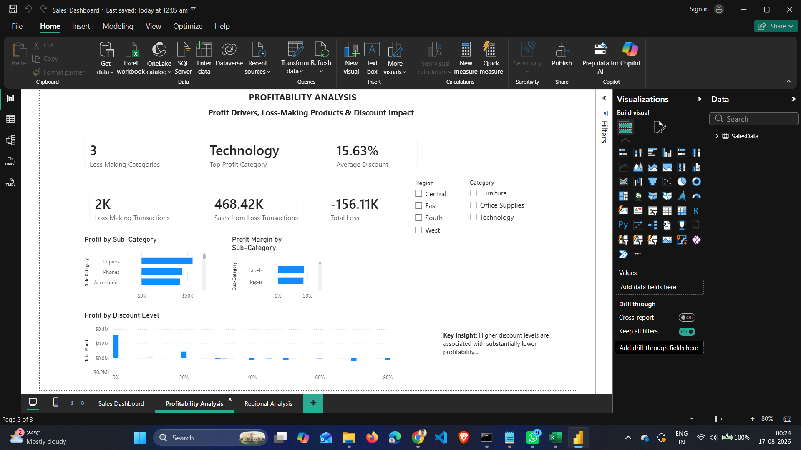
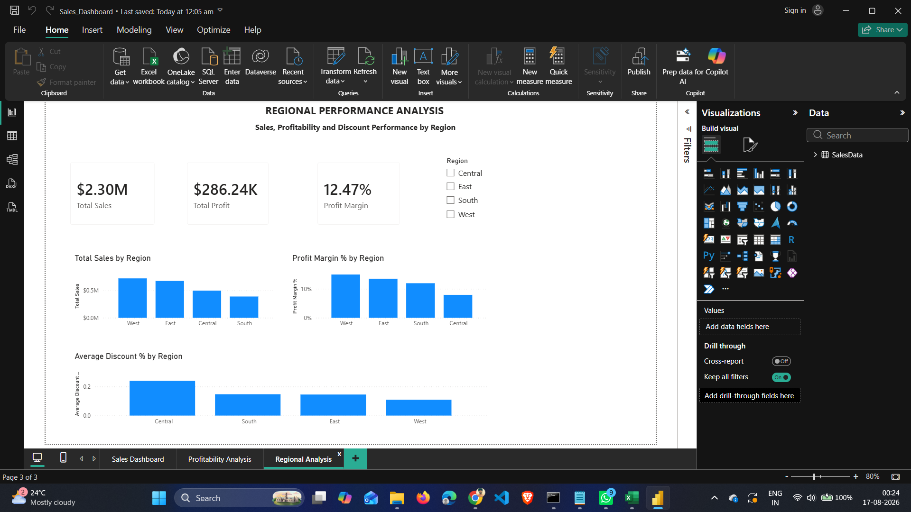

# Superstore Sales & Profitability Analysis

## 📌 Project Overview

This project analyzes Superstore sales data to identify patterns in sales, profitability, discounts, product categories, regions, and customer segments.

The project follows an end-to-end data analytics workflow using MySQL, Excel, and Power BI.

**Dataset → MySQL → SQL Analysis → Excel KPI Analysis → Power BI Dashboard → Business Insights**

---

## 🎯 Business Problem

The objective of this project is to understand the company's sales and profitability performance and identify areas that require business attention.

The analysis answers questions such as:

- What are the overall sales and profit?
- Which categories generate the most sales and profit?
- Which regions perform best?
- Which customer segments are most profitable?
- Which sub-categories generate losses?
- How does discounting affect profitability?
- Which areas should management focus on to improve profitability?

---

## 📊 Dataset

The Superstore dataset was obtained from Kaggle and prepared for analysis.

The final dataset used in this project contains:

- **9,977 transactions**
- **13 columns**

### Main Columns

| Column | Description |
|---|---|
| Ship Mode | Shipping method |
| Segment | Customer segment |
| Country | Country |
| City | Customer city |
| State | Customer state |
| Postal Code | Postal code |
| Region | Sales region |
| Category | Product category |
| Sub-Category | Product sub-category |
| Sales | Sales amount |
| Quantity | Quantity sold |
| Discount | Discount percentage |
| Profit | Profit generated |

---

## 🛠️ Tools Used

- **MySQL 8.0** — Data validation, SQL analysis and business analysis
- **Microsoft Excel Online** — KPI calculations and supporting analysis
- **Microsoft Power BI Desktop** — Interactive dashboard and visualization
- **GitHub** — Project documentation and version control

---

## 🔄 Project Workflow

### 1. Data Preparation

The dataset was imported into MySQL and validated for:

- Missing values
- Duplicate records
- Negative sales
- Negative profit
- Data types
- Categories
- Regions
- Segments

Negative profit records were retained because they represent genuine loss-making transactions.

### 2. SQL Analysis

SQL was used to perform:

- Overall KPI analysis
- Category analysis
- Regional analysis
- Segment analysis
- Sub-category analysis
- State-level analysis
- Discount analysis
- Profit margin analysis
- Ranking analysis
- Loss-making transaction analysis

The SQL queries are available in:

`SQL/superstore_analysis.sql`

### 3. Excel Analysis

Excel was used to organize and calculate key project KPIs, including:

- Total Sales
- Total Profit
- Total Quantity
- Average Discount
- Profit Margin
- Number of Transactions

### 4. Power BI Dashboard

Power BI was used to create an interactive dashboard containing:

- KPI cards
- Sales by Category
- Profit by Category
- Regional analysis
- Segment analysis
- Sub-category analysis
- Discount analysis
- Interactive slicers

---

## 📈 Key KPIs

| KPI | Value |
|---|---:|
| Total Sales | $2.30M |
| Total Profit | $286.24K |
| Total Quantity | 37,820 |
| Average Discount | 15.63% |
| Profit Margin | 12.47% |
| Transactions | 9,977 |

---

# 🔍 Key Business Findings

## 1. Category Performance

Technology generated the highest sales and profit.

| Category | Total Sales | Total Profit | Profit Margin |
|---|---:|---:|---:|
| Technology | $836.15K | $145.46K | 17.40% |
| Furniture | $741.31K | $18.42K | 2.49% |
| Office Supplies | $718.74K | $122.36K | 17.03% |

### Insight

Furniture generated substantial sales but had a significantly lower profit margin than Technology and Office Supplies.

---

## 2. Regional Performance

The West region generated the highest sales and profit.

| Region | Total Sales | Total Profit | Profit Margin |
|---|---:|---:|---:|
| West | $725.26K | $108.33K | 14.94% |
| East | $678.44K | $91.51K | 13.49% |
| South | $391.72K | $46.75K | 11.93% |
| Central | $500.78K | $39.66K | 7.92% |

### Insight

The Central region had the lowest profit margin at 7.92%, indicating a need to investigate pricing, discounts, and product mix.

---

## 3. Segment Performance

Consumer generated the highest sales and total profit, while Home Office had the highest profit margin.

| Segment | Total Sales | Total Profit | Profit Margin |
|---|---:|---:|---:|
| Consumer | $1.16M | $134.01K | 11.54% |
| Corporate | $706.07K | $91.96K | 13.02% |
| Home Office | $429.29K | $60.28K | 14.04% |

### Insight

Home Office generated the lowest sales but achieved the highest profit margin.

---

## 4. Sub-Category Performance

Phones generated the highest sales, while Copiers generated the highest profit.

The major loss-making sub-categories were:

| Sub-Category | Total Profit |
|---|---:|
| Tables | -$17.73K |
| Bookcases | -$3.47K |
| Supplies | -$1.19K |

### Insight

Tables generated significant sales but produced the largest overall loss.

---

## 5. Discount Impact

Discounting had a strong relationship with profitability.

| Discount Level | Total Sales | Total Profit | Profit Margin |
|---|---:|---:|---:|
| No Discount | $1.09M | $320.84K | 29.51% |
| Low Discount | $846.43K | $100.76K | 11.90% |
| Medium Discount | $233.86K | -$35.81K | -15.31% |
| High Discount | $128.63K | -$99.55K | -77.40% |

### Insight

Higher discount levels were associated with significantly lower profitability and, at medium and high levels, negative profit.

---

# 💡 Business Recommendations

### 1. Review Furniture Profitability

Furniture has high sales but a very low profit margin.

Management should review:

- Product pricing
- Product costs
- Supplier costs
- Discount levels

### 2. Control High Discounts

High discounts resulted in significant losses.

Discount policies should be reviewed, particularly for products where discounts result in negative margins.

### 3. Investigate Tables

Tables generated the largest sub-category loss.

The business should investigate pricing, costs, discounts, and product-level profitability.

### 4. Improve Central Region Profitability

The Central region had the lowest profit margin.

Management should investigate the region's product mix, pricing, and discount strategy.

### 5. Focus on High-Margin Products

Products and sub-categories with strong profit margins should receive greater attention in sales and marketing strategies.

---

# 📊 Power BI Dashboard

## Page 1 — Sales Overview



---

## Page 2 — Profitability Analysis



---

## Page 3 — Regional & Discount Analysis



---

# 📁 Project Structure

```text
superstore-sales-analysis/
│
├── README.md
│
├── SQL/
│   └── superstore_analysis.sql
│
├── PowerBI/
│   └── Superstore_Sales_Dashboard.pbix
│
├── Excel/
│   └── Superstore_KPI_Analysis.xlsx
│
├── Data/
│   └── SampleSuperstore_Cleaned.csv
│
└── Screenshots/
    ├── page1_overview.png
    ├── page2_profitability.png
    └── page3_analysis.png
